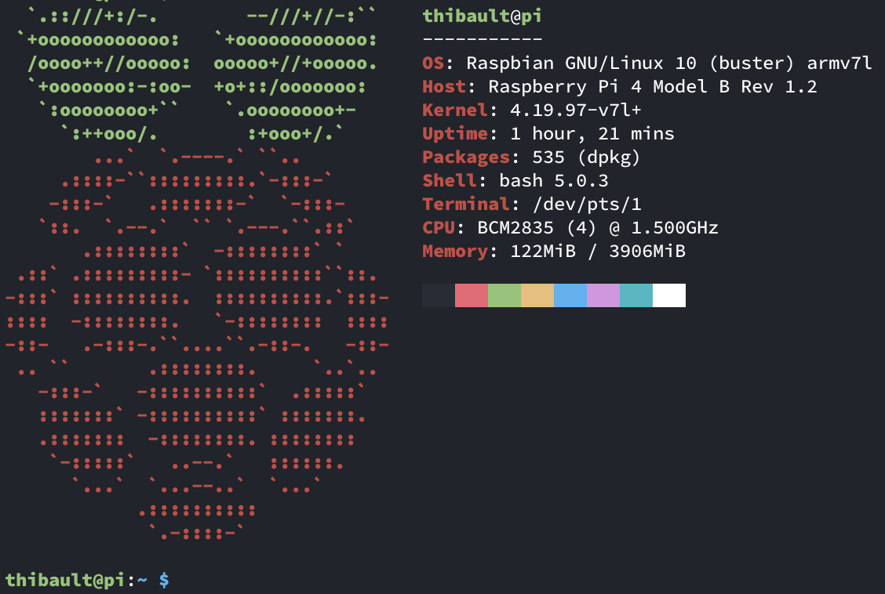

# pifiles

Configuration files and step by step guide to setup a [Raspbian](https://www.raspberrypi.org/documentation/raspbian/) Buster Lite (headless).

<p align="center">
  
</p>

## Getting started

- Enable ssh by adding an empty `ssh` file into the sd card:
```
cd /Volumes/boot
touch ssh
```

- Connect to the pi:
```
# get the ip address of the pi:
arp -a
# ssh with default user/password: pi/raspberry
ssh pi@192.168.xxx.xxx
```

- Update the root password:
```
$ sudo passwd root
```

- Create a new user and add it to the sudo group:
```
$ sudo adduser thibault
$ sudo adduser thibault sudo
```

- Disable Wifi/Wlan and Bluetooth permanently:
```
# its "pi3", even for the pi4
$ echo "dtoverlay=pi3-disable-wifi" | sudo tee -a /boot/config.txt
$ echo "dtoverlay=pi3-disable-bt" | sudo tee -a /boot/config.txt
```

- Disable unwanted services:
```
# list enabled services
$ systemctl list-unit-files | grep enabled

# $ sudo systemctl disable bluetooth triggerhappy
# $ sudo systemctl stop bluetooth triggerhappy
```

- Change basic pi config and reboot when prompted:
```
$ sudo raspi-config

# Localisation Options > Change Timezone
# Neywork Options > Hostname
```

- SSH with the newly created user and delete the pi user:
```
$ ssh thibault@192.168.xxx.xxx

$ sudo deluser -remove-home pi
$ sudo rm /etc/sudoers.d/010_pi-nopasswd
```

## Dotfiles

- Before using these files, on the client:
```
# generate ssh key pair, use Ed25519 algorithm
$ ssh-keygen -t ed25519 -o -a 100

# add private key to the authentication agent
$ ssh-add ~/.ssh/pi_ed25519

# install the public key to the pi
$ ssh-copy-id -i ~/.ssh/pi_ed25519.pub thibault@192.168.xxx.xxx
```

- Update local `~/.ssh/config` to enable `ssh pi`:
```
Host pi
    Hostname pi.local
    User thibault
    IdentityFile ~/.ssh/pi_ed25519
```

- Copy this repo into the home folder of the pi user:
```
git clone https://github.com/ThibaultLaurens/pifiles.git
scp -r pifiles thibault@pi:~
```

- The following steps can be run independently or with a single command:
```
source pifiles/setup.sh
```

### APT

- Update, upgrade and install packages:
```
source pifiles/apt.sh
```

### Bash

- Install / update bash and bash-completion.
- Create a soft link for custom bash aliases
- Reload `~/.bashrc`
```
source pifiles/bash/setup.sh
```
